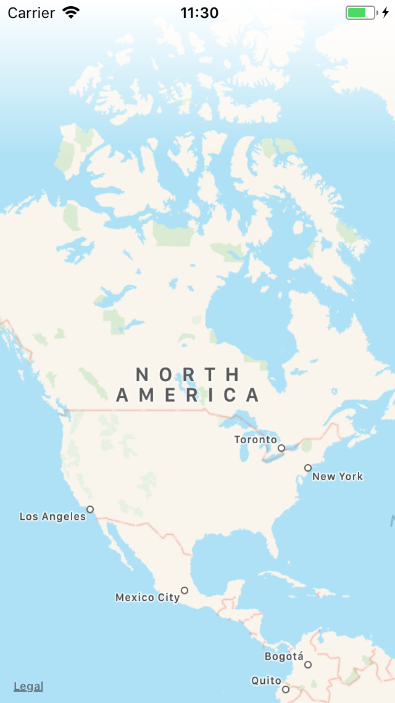

# Demo for using gradient overlay view

This is a demo project of showing how to create a gradient view and use it. 

## How does it work? 

Step 1. Define a custom gradient view (Swift 4):

    import UIKit
    
    class GradientView: UIView {
        override open class var layerClass: AnyClass {
            return CAGradientLayer.classForCoder()
        }
    
        required init?(coder aDecoder: NSCoder) {
            super.init(coder: aDecoder)
            let gradientLayer = self.layer as! CAGradientLayer
            gradientLayer.colors = [
                UIColor.white.cgColor,
                UIColor.init(white: 1, alpha: 0).cgColor
            ]
            backgroundColor = UIColor.clear
        }
    }

Step 2. - Drag and drop a `UIView` in your storyboard and set its custom class to `GradientView`

## Result

This is the final result of how it looks as an overlay on the map view. 

